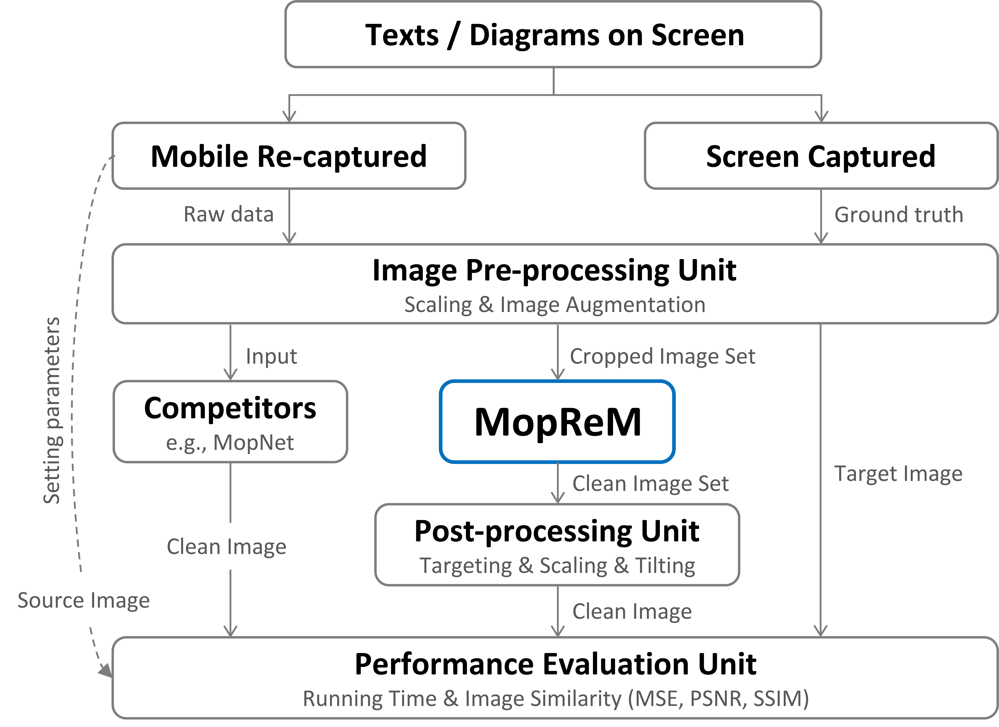

# MopReM
Moiré Pattern Removal for Mobile, Texts/Diagrams on Single-colored Background

### Data
* Screen captured image `target.png`
* Mobile re-captured image `source.png`

### State of the art methods
* MopNet
* WDNet
* SilentMoire

